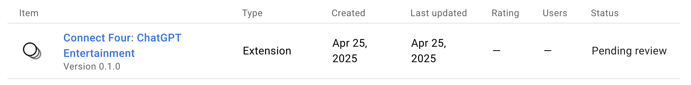
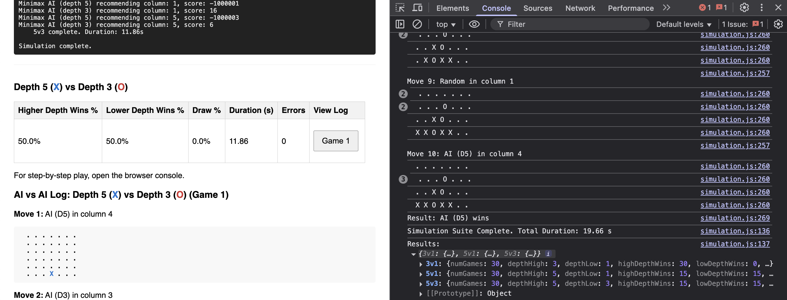
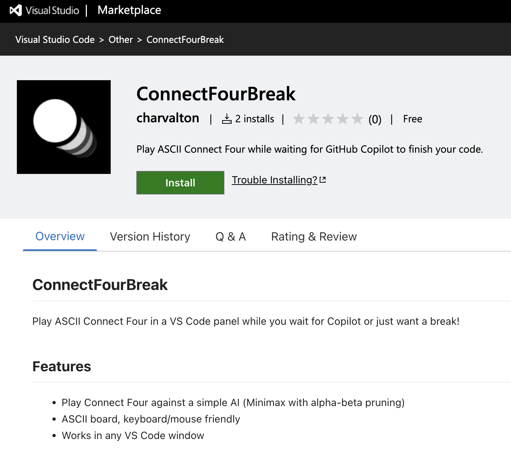

# ChatGPT Connect Four Break (Chrome Extension)

**[View Demo Video on YouTube](https://www.youtube.com/watch?v=sGJ0lAW8Q54)**

**Author:** Carl Kho

**Course:** CS152 (Artificial Intelligence) - Spring 2025

**Instructor:** Professor Rohan Shekhar, PhD

Testing Included

Play Connect Four in a beautiful, modern modal while waiting for ChatGPT responses! This extension adds a seamless, keyboard-accessible Connect Four game to the ChatGPT interface, styled to match the ChatGPT brand.

## Overview

This Google Chrome Extension provides a simple, engaging way to utilize the wait times encountered while interacting with ChatGPT. It seamlessly integrates an ASCII-styled Connect Four game directly into the ChatGPT web interface, allowing users to play against an AI opponent during response generation or whenever they choose.

The project initially aimed for a VS Code extension targeting GitHub Copilot (published as ["ConnectFourBreak" on VS Code Marketplace](https://marketplace.visualstudio.com/items?itemName=charvalton.connectfourbreak) - *Note: Limited functionality due to technical constraints*). However, due to the inability to reliably detect Copilot's state, the project **pivoted** to this Chrome Extension targeting ChatGPT, where DOM observation provides a feasible, albeit heuristic, activation mechanism.

The core AI opponent is implemented using **Minimax** with **Alpha-Beta Pruning**, directly applying concepts from CS152.

In case you're interested in the VS Code version. Here's the link to the [Connect Four VS Code Extension](https://marketplace.visualstudio.com/items/?itemName=charvalton.connectfourbreak).

## Features

* **Play Connect Four vs AI**: Challenge an AI opponent implemented with Minimax & Alpha-Beta pruning.
* **Seamless ChatGPT Integration**: Game appears in a modal styled to match ChatGPT's dark theme. *(See Figure 1 in Report Appendix C)*
* **Automatic Activation (Heuristic)**: Game modal heuristically pops up when ChatGPT starts generating a longer response (detects "Stop streaming" button).
* **Manual Activation**: Click the "Play" button added near the chat input bar.
* **Session Toggle**: Right-click the "Play" button to disable/enable automatic pop-up for the current browser session (button turns blue when disabled).
* **Keyboard Controls**:
  * `1-7`: Drop a piece in the corresponding column.
  * `R`: Restart the current game.
* **Custom Tooltip**: Clear tooltip on the "Play" button explains its function and toggle state.
* **Local & Private**: All game logic and AI calculations run entirely within your browser. No data is sent externally.

## Installation

**Option 1: From Chrome Web Store (Recommended for Users)**

1. *(Status: Pending Review as of Apr 25, 2025)* Visit the [Chrome Web Store Listing](<Your-CWS-Link-Goes-Here-Once-Approved>)
2. Click "Add to Chrome".

**Option 2: From Source (For Developers / Professor Shekhar)**

1. **Clone or Download:** Get the code from this repository (`git clone https://github.com/CarlKho-Minerva/4-Connect_VS-Code_CS152_25MNRV.git`).
2. **Open Chrome Extensions:** Navigate to `chrome://extensions/` in your Chrome browser.
3. **Enable Developer Mode:** Toggle the "Developer mode" switch, usually found in the top-right corner.
4. **Load Unpacked:** Click the "Load unpacked" button.
5. **Select Folder:** Browse to and select the `chrome-extension` sub-directory within the cloned repository folder (the one containing `manifest.json`).
6. The extension should now be installed and active. Visit [chatgpt.com](https://chatgpt.com/) to see the "Play" button near the input bar.

## Usage

1. **Automatic Mode:** When ChatGPT starts generating a response (specifically, when the "Stop streaming" button appears), the Connect Four modal should pop up (unless disabled via right-click). It will hide automatically when the response finishes (when the "Stop streaming" button disappears).
2. **Manual Mode:** Click the "Play" button near the chat input at any time to open the game modal.
3. **Disabling Auto-Popup:** Right-click the "Play" button. It will turn blue, indicating automatic popups are disabled for that browser session. Right-click again to re-enable.
4. **Playing the Game:**
    * Use mouse clicks on the column numbers (1-7) or press the corresponding number keys on your keyboard to drop your piece (Blue).
    * The AI opponent (Orange) will make its move after a short delay.
    * Press 'R' to restart the game at any time.
    * Click the 'X' button on the modal or click outside the modal area to close it.

## Technical Details & How It Works

* **Platform:** Google Chrome Extension.
* **UI Injection (`content.js`):** Injects the "Play" button and the `<iframe>` container for the modal into the ChatGPT webpage DOM.
* **Triggering (`content.js`):** Uses a `MutationObserver` to watch for the appearance/disappearance of the `button[aria-label="Stop streaming"]` element as a proxy for ChatGPT's generation state. This is a *heuristic* and might break if ChatGPT changes its UI significantly.
* **Game Interface (`modal.html`, `modal.css`, `modal.js`):** An iframe provides a sandboxed environment for the game. `modal.js` handles rendering the board (based on `gameLogic.js`), user input, and communication with the AI.
* **Game Logic (`gameLogic.js`):** Contains the core rules of Connect Four (board state, valid moves, win/draw checks).
* **AI Opponent (`aiLogic.js`):** Implements the Minimax algorithm with Alpha-Beta pruning (depth 5 default) and a custom heuristic evaluation function (`scorePosition`) to choose moves.

## Running Simulations / Testing AI Performance

For evaluating the AI more rigorously (as done for the final report):

1. Ensure you have cloned the full repository.
2. Navigate to the `tests-simulations` directory in your file explorer.
3. Open the `simulation.html` file directly in your Google Chrome browser (`File > Open File...`).
4. You will see two main test options:
    * **"Run Single Game Log (D5 vs Random)":** Click this to run one game where the AI (Depth 5) plays against a random opponent (who is forced to open in the center). A detailed move-by-move log, including board states, will be displayed directly on the page and printed to the browser's developer console (Press `F12` to open). This is useful for qualitative analysis (See Report Appendix B).
    * **"Run AI vs AI Suite":** Click this to run the quantitative performance tests. It will run multiple games (default 30 per matchup) pitting the AI at different search depths against each other (D3vD1, D5vD1, D5vD3), alternating the starting player. This may take several seconds to complete. A summary table showing win/loss/draw percentages and timings will be displayed on the page. This data demonstrates the impact of search depth (See Report Appendix E). Detailed logs for each game in the suite are available in the browser console.

## Limitations

* **Trigger Fragility:** The automatic activation relies on observing specific elements in the ChatGPT DOM. Future updates to ChatGPT's website structure *will likely break* this feature, requiring updates to `content.js`. The manual "Play" button provides a more robust fallback.
* **AI Strength:** The AI (Depth 5 with current heuristic) is designed for casual play, not expert-level competition. It can be beaten by experienced players, especially those setting up multi-move traps.
* **VS Code Version:** The initial VS Code extension ("ConnectFourBreak") remains published but is functionally limited compared to this Chrome version due to the inability to reliably trigger based on Copilot state.

## Credits

* AI Algorithm implementation (Minimax, Alpha-Beta, Heuristic) based on concepts learned in CS152, Minerva University.
* Initial project concept adapted from the VS Code extension "ConnectFourBreak" by Carl Kho.
* UI styling inspired by ChatGPT's interface.
* Utilized GitHub Copilot and ChatGPT for implementation assistance, debugging, and documentation drafting.

## License

MIT License (Include the full license text if desired, or link to a LICENSE file)
