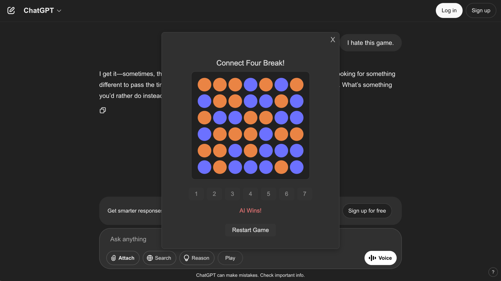

# ChatGPT Connect Four Break (Chrome Extension)

[View Connect4GPT Demo](https://www.youtube.com/watch?v=sGJ0lAW8Q54)

Play Connect Four in a beautiful, modern modal while waiting for ChatGPT responses! This extension adds a seamless, keyboard-accessible Connect Four game to the ChatGPT interface, styled to match the ChatGPT brand.

## Features
- **Play Connect Four**: Challenge an AI opponent while you wait for ChatGPT to respond.
- **Modern UI**: Game modal and controls blend with ChatGPT's dark theme.
- **Keyboard Shortcuts**: Use 1-7 to drop pieces, R to restart, D to toggle auto-popup.
- **Session Toggle**: Right-click the Play button to disable/enable auto-popup for the session.
- **Custom Tooltip**: Clear, branded tooltip explains Play button behavior.
- **Responsive & Accessible**: Game is fully keyboard and mouse accessible.

## Installation (Development)
1. **Clone or Download** this repository.
2. Go to `chrome://extensions/` in Chrome.
3. Enable **Developer mode** (top right).
4. Click **Load unpacked** and select the `chatgpt-connectfour-extension` folder.
5. Go to [chat.openai.com](https://chat.openai.com/) and look for the Play button in the chat bar.

## Usage
- **Auto-Launch**: The game modal pops up automatically when ChatGPT starts streaming a response (unless disabled for the session).
- **Manual Launch**: Click the Play button in the chat bar to open the game at any time.
- **Disable/Enable Auto-Launch**: Right-click the Play button to toggle auto-popup for the session. The button turns blue when disabled.
- **Keyboard Controls**:
  - `1-7`: Drop a piece in the corresponding column
  - `R`: Restart the game
  - `D`: Toggle auto-popup for the session

## How It Works
- Injects a Play button into the ChatGPT chat bar.
- Shows a modal with a Connect Four game (AI opponent) in a style matching ChatGPT.
- Uses MutationObservers to detect ChatGPT streaming and UI changes.
- All code runs locally in your browser; no data is sent anywhere.

## Permissions
- `storage`: For session toggle (if you want to persist across reloads, currently session only)
- `scripting`: To inject the modal and game
- `host_permissions`: Only for `https://chat.openai.com/*`

## Credits
- Connect Four AI and logic adapted from the VS Code extension by cvk.
- UI inspired by ChatGPT's brand and user experience.

## License
MIT